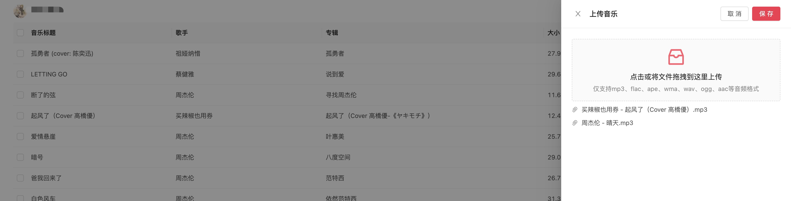

#  netease-cloud-uploader


Mac 版网易云音乐暂不支持上传音乐至音乐云盘的功能，目前网上的解决办法：
* 安装双系统然后使用 Windows 版网易云音乐；
* icloud 云盘；
* 微信转发；
* ...

这些解决办法感觉还是比较麻烦，有的方法还不一定能成功，最后看到有一个网易云音乐API的项目 [NeteaseCloudMusicApi](https://github.com/Binaryify/NeteaseCloudMusicApi) ，并且支持在 Node.js 中调用，于是想着可以用该项目提供的 Api 搞一个 Web 端以方便在 Mac 上上传音乐至音乐云盘。

## 运行
```shell
$ git clone https://github.com/llaurora/netease-cloud-uploader
$ cd netease-cloud-uploader
$ npm install
$ npm start
```
浏览器地址栏输入 http://localhost:8080 以打开页面（默认端口为 8080）

## 功能
* 支持二维码登录；
* 支持手机号码和密码登录；
* 支持音乐批量上传；
* 支持音乐批量删除；


